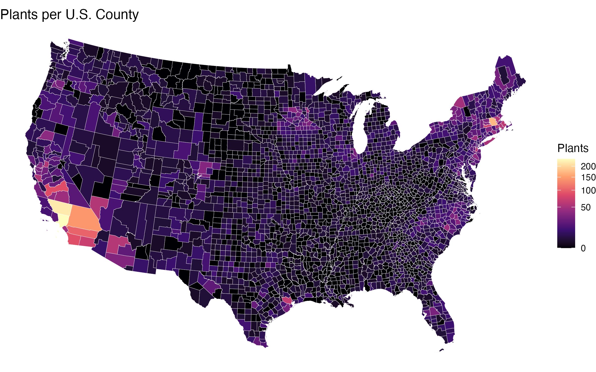
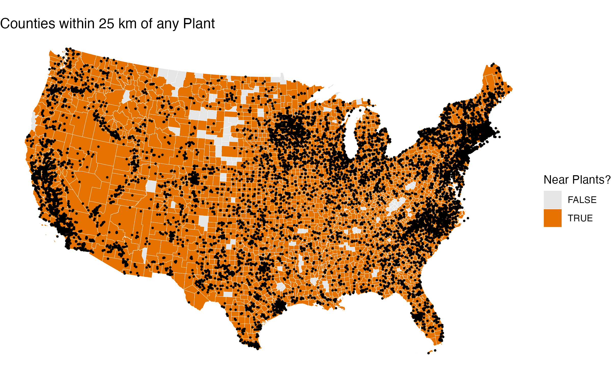
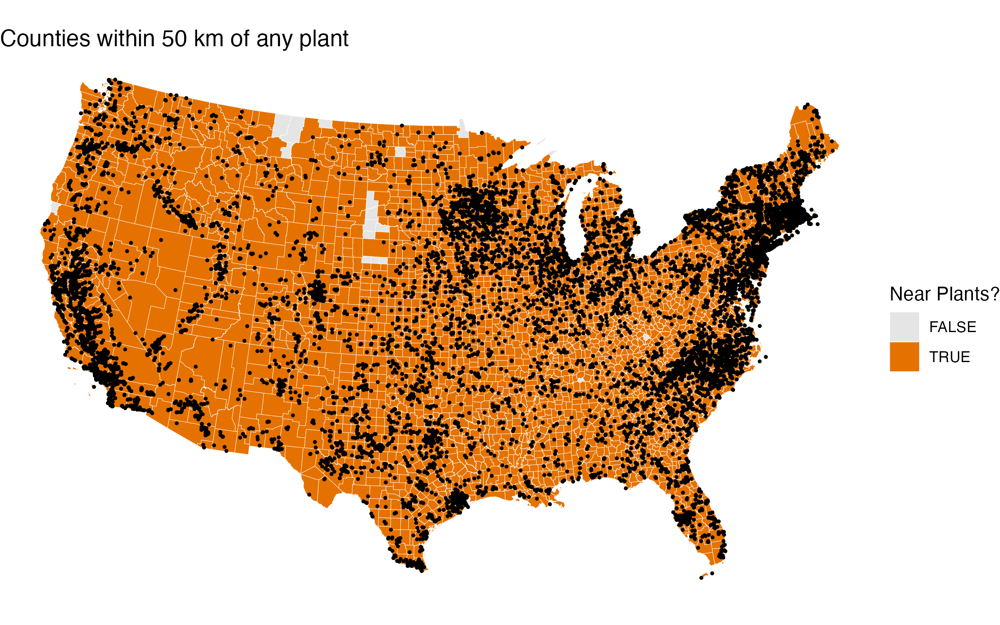
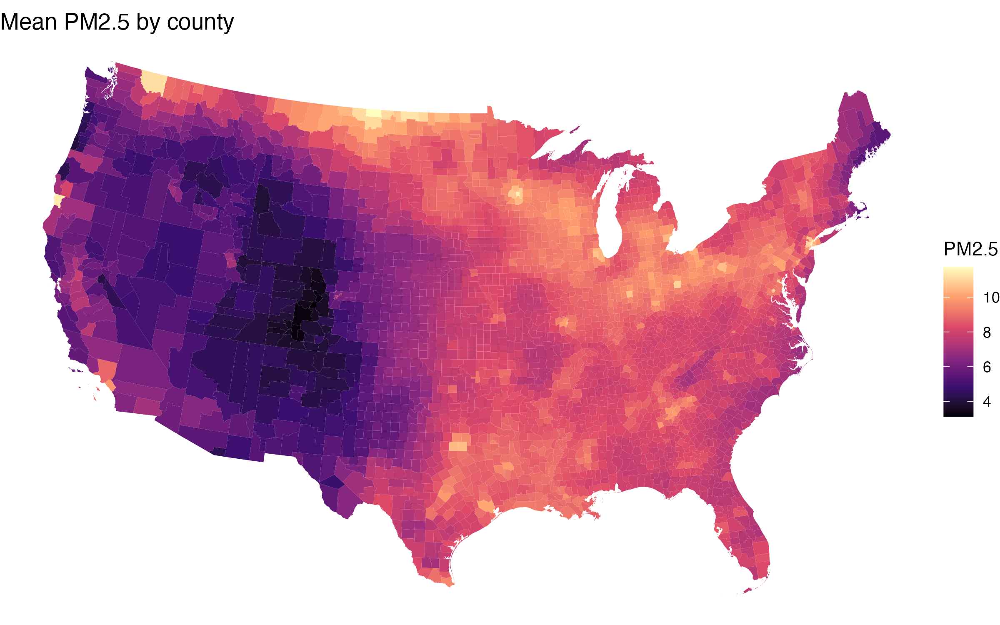

# Power Plants and PM2.5: A Spatial Comparison

## Methods

**Q1: Plants per county.** 12,175 of 12,185 plants matched a county, meaning we were left with 10 plants that did not match a county. 

**Q2: Plants within 25 km and 50 km.** I buffered each plant by 25 km and 50 km and counted how many buffers intersect each county. I chose 25 km as a more conservative radius and 50 km to capture the larger zone where PM2.5 concentrations from taller stacks are elevated (Levy et al. 2009).

**Q3: Mean PM2.5.** Used an exact extract to find each county's mean PM2.5 concentration. Comparisons listed below:

## Comparison

**Within-county definition:**

| Has Plants | Mean PM2.5 (µg/m³) | Number of Counties |
|------------|--------------------:|-------------------:|
| FALSE      |                7.99 |                974 |
| TRUE       |                7.88 |               2135 |

**Nearby definition (25 km buffer):**

| Has Nearby Plants | Mean PM2.5 (µg/m³) | Number of Counties |
|-------------------|--------------------:|-------------------:|
| FALSE             |                7.86 |                107 |
| TRUE              |                7.92 |               3002 |

**Nearby definition (50 km buffer):**

| Has Nearby Plants | Mean PM2.5 (µg/m³) | Number of Counties |
|-------------------|--------------------:|-------------------:|
| FALSE             |                8.14 |                 18 |
| TRUE              |                7.92 |               3091 |

## Discussion

Counties *without* plants have slightly higher mean PM2.5 than counties with plants (7.99 vs. 7.88). The nearby plants, however, flip the sign. Counties with plants within 25 km have slightly higher PM2.5 (7.92 vs. 7.86). Both differences are small (~0.1 µg/m³). At 50 km, the pattern is similar to the within-county result. The 18 counties with no nearby plants have a higher mean PM2.5 (8.14) than those with plants nearby (7.92). Given that there are only 18 counties without a nearby plant, however, this average is based on a very small number. 

The picture changes slightly between the comparisons, but neither shows a strong raw relationship between power plants and PM2.5. I'd like to emphasize that this is not a causal relationship. There are many features of counties that could impact PM2.5 levels outside of power plant presence. 69% of counties contain a power plant and 97% have one within 25 km, which also could limit the variation available to detect a difference.
